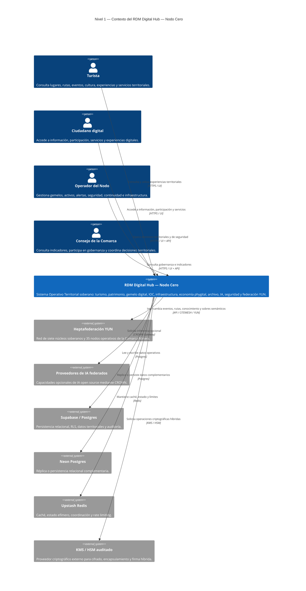
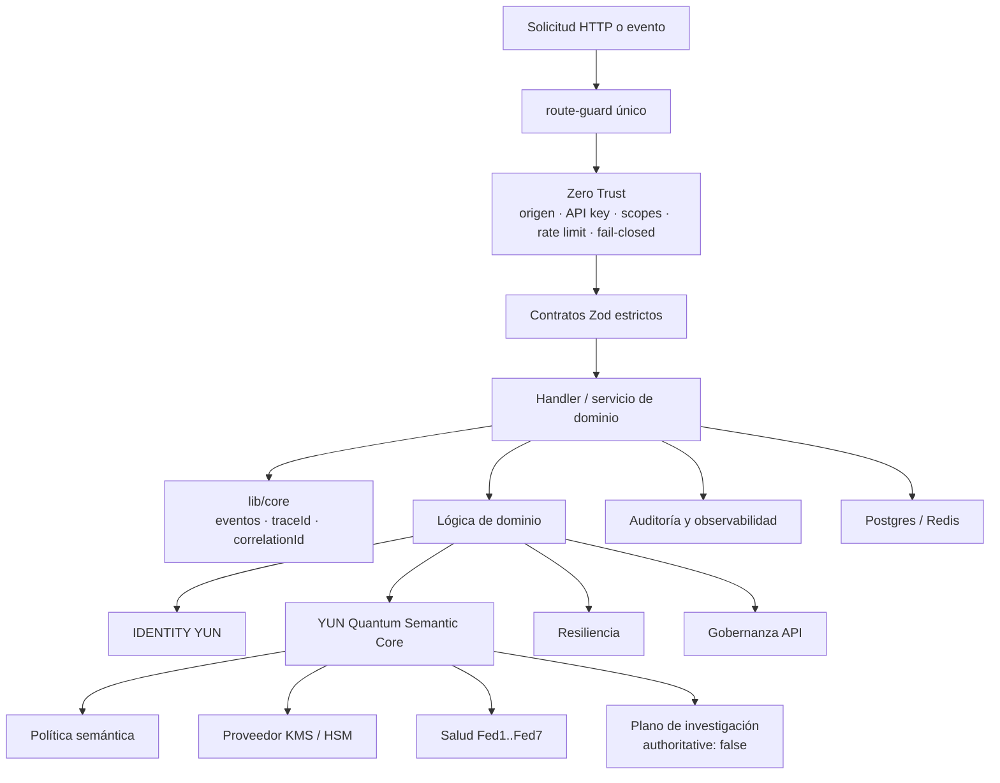

# C4 — Diagrama de Contexto y Contenedores del RDM Digital Hub (Nodo Cero)

- **Área:** Arquitectura de Software / Documentación C4
- **Propósito:** Definir la estructura jerárquica del RDM Digital Hub — Nodo Cero en los niveles de Contexto, Contenedores, Componentes y Código.
- **Sistema:** RDM Digital Hub — Nodo Cero
- **Ubicación:** Real del Monte, Hidalgo, México
- **Arquitectura:** Heptafederación YUN
- **Versión del documento:** 2026
- **Estado:** Vigente

---

## Propósito arquitectónico

El **RDM Digital Hub — Nodo Cero** es el Sistema Operativo Territorial soberano de Real del Monte. Integra patrimonio, turismo, infraestructura urbana, gemelo digital, operación municipal, economía local, identidad, continuidad, archivo histórico, conocimiento federado e inteligencia cognitiva bajo una arquitectura modular y heptafederada.

Este documento aplica el modelo C4 para describir el sistema de forma progresiva:

| Nivel | Enfoque | Pregunta que responde |
|---|---|---|
| Nivel 1 | Contexto | ¿Qué es el sistema y con quién se relaciona? |
| Nivel 2 | Contenedores | ¿Qué aplicaciones, servicios y almacenes lo componen? |
| Nivel 3 | Componentes | ¿Qué módulos transversales y dominios sostienen la operación? |
| Nivel 4 | Código | ¿Dónde vive la implementación y qué documentos detallan sus contratos? |

---

# Nivel 1 · Contexto del Sistema

## Visión general

El Nodo Cero opera como el **Gemelo Territorial de Real del Monte** y como nodo soberano de la **Heptafederación YUN**. Atiende actores humanos, integra servicios territoriales y establece relaciones controladas con infraestructura de persistencia, redes federadas, proveedores opcionales de IA y proveedores criptográficos auditados.

```text
            ┌───────────────────────────────────────────────┐
            │           RDM DIGITAL HUB — NODO CERO          │
            │     Gemelo territorial de Real del Monte       │
            │         Sistema Operativo Territorial           │
            └───────────────────────────────────────────────┘
                          ▲            │
        (UI / App)        │            │   (APIs /api/*)
   Turista · Ciudadano    │            ▼
   Operador · Consejo  ───┤   ┌───────────────────────┐
                          │   │   Heptafederación YUN │
                          │   │   7 núcleos · 35 nodos│
                          │   └───────────────────────┘
                          │
                          ▼
      Supabase / Neon / Redis / KMS-HSM / IA opcional
```



## Actores externos

| Actor o sistema externo | Relación con Nodo Cero |
|---|---|
| Turista | Consulta rutas, lugares, eventos, agenda, gastronomía, cultura y experiencias phygital |
| Ciudadano digital | Accede a servicios, información, herramientas comunitarias y participación territorial |
| Operador del Nodo | Gestiona IOC, activos, incidentes, telemetría, seguridad, continuidad y federación |
| Consejo de la Comarca | Consulta indicadores y participa en gobernanza, coordinación y decisiones territoriales |
| Heptafederación YUN | Red federada de siete núcleos soberanos y 35 nodos operativos |
| Proveedores de IA federados | Capacidades opcionales a través de CROWN; no son requisito para ISA soberano |
| Supabase / Postgres | Persistencia principal, RLS, dominios territoriales, identidad y auditoría |
| Neon Postgres | Réplica, persistencia complementaria y capacidad de recuperación |
| Upstash Redis | Caché TTL, estado efímero, rate limiting y coordinación |
| KMS / HSM | Custodia de claves y operaciones criptográficas híbridas auditables |

## Límites de confianza

El sistema distingue límites de confianza para evitar que un servicio, actor o integración reciba privilegios que no le corresponden.

| Límite | Regla principal |
|---|---|
| Cliente a API | Toda solicitud atraviesa autenticación, autorización, validación de origen y rate limiting |
| Dominio a dominio | Los contratos Zod y el bus de eventos preservan trazabilidad con `traceId` y `correlationId` |
| Nodo a federación | CITEMESH, GEMET y QSC validan ruteo, procedencia, integridad y políticas |
| Aplicación a persistencia | El acceso aplica mínimo privilegio, RLS y separación de datos por dominio |
| QSC a KMS/HSM | Las operaciones post-cuánticas reales se delegan a un proveedor criptográfico auditado |
| ISA a proveedores externos | CROWN puede usar proveedores opcionales; las zonas soberanas críticas mantienen zero egress |
| Plano de investigación | Solo recibe métricas y cubos agregados; no es una fuente autoritativa |

---

# Nivel 2 · Contenedores

## Vista de contenedores

El Nodo Cero se implementa principalmente como una aplicación web Next.js con rutas API, módulos de dominio, infraestructura transversal, persistencia relacional y estado efímero.

```mermaid
C4Container
    title Nivel 2 — Contenedores del RDM Digital Hub — Nodo Cero

    Person(usuario, "Usuario", "Turista, ciudadano, operador o miembro del Consejo.")

    System_Boundary(nodoCero, "RDM Digital Hub — Nodo Cero") {
        Container(web, "Aplicación web", "Next.js 16 / React 19 / TypeScript", "Páginas territoriales, paneles, visualizaciones, administración y experiencias phygital.")
        Container(api, "API del Nodo", "Next.js Route Handlers", "Rutas /api/* con route-guard único, contratos Zod y políticas Zero Trust.")
        Container(core, "Núcleo transversal", "TypeScript", "Eventos, entorno, contratos, utilidades, persistencia y trazabilidad.")
        Container(isabella, "Isabella / ISA / CROWN", "TypeScript", "Asistente cognitivo, razonamiento soberano, MEXA, firmas MSR y gateway de IA opcional.")
        Container(domains, "Dominios territoriales", "TypeScript", "Twins, City, Assets, Grid, Marketplace, Turismo, Payments y Gamification.")
        Container(identity, "IDENTITY YUN", "TypeScript", "API keys soberanas, scopes, rotación, revocación e introspección.")
        Container(citemesh, "CITEMESH", "TypeScript", "Registro P2P, heartbeat, topologías, ruteo federado y failover.")
        Container(gemet, "GEMET", "TypeScript", "Grafo de conocimiento federado, ontologías, checksums, réplicas y caché firmada.")
        Container(continuity, "Continuity", "TypeScript", "Journal, hash-chain, reconciliación, aislamiento y activación operacional.")
        Container(archive, "Archive", "TypeScript", "Archivo histórico, colecciones, curación, búsqueda y checksums canónicos.")
        Container(qsc, "YUN Quantum Semantic Core", "TypeScript", "Sobres semánticos, políticas, integridad, firmas híbridas y salud federada.")
        Container(observability, "Monitor y Observability", "TypeScript", "Health, métricas, trazas, alertas, SLO/RED y estado del fabric.")
        ContainerDb(postgres, "Persistencia relacional", "Supabase Postgres / Neon", "Datos territoriales, identidad, auditoría, continuidad y archivo.")
        ContainerDb(redis, "Caché y estado", "Upstash Redis", "Caché TTL, límites, estado temporal y coordinación.")
    }

    System_Ext(yun, "Heptafederación YUN", "Siete federaciones y 35 nodos.")
    System_Ext(ai, "Bóveda IA federada", "Proveedores open source opcionales.")
    System_Ext(kms, "KMS / HSM", "Proveedor criptográfico auditado.")

    Rel(usuario, web, "Utiliza", "HTTPS")
    Rel(web, api, "Consume", "HTTPS / JSON")

    Rel(api, core, "Usa contratos, entorno, eventos y trazabilidad")
    Rel(api, identity, "Autentica y autoriza API keys")
    Rel(api, domains, "Ejecuta operaciones territoriales")
    Rel(api, isabella, "Solicita operaciones cognitivas")
    Rel(api, citemesh, "Registra nodos y enruta paquetes")
    Rel(api, gemet, "Consulta y publica conocimiento")
    Rel(api, continuity, "Registra y activa continuidad")
    Rel(api, archive, "Gestiona archivo y curación")
    Rel(api, qsc, "Crea, sella y verifica sobres")
    Rel(api, observability, "Emite estado y telemetría")

    Rel(domains, qsc, "Protege eventos sensibles o federados")
    Rel(citemesh, qsc, "Transporta sobres sin alterar su contenido")
    Rel(gemet, qsc, "Protege procedencia de conocimiento federado")
    Rel(continuity, qsc, "Conserva evidencia semántica de eventos críticos")
    Rel(archive, qsc, "Preserva procedencia e integridad documental")

    Rel(core, postgres, "Lee y escribe", "Postgres")
    Rel(identity, postgres, "Persiste claves y metadatos", "Postgres")
    Rel(domains, postgres, "Persiste datos de dominio", "Postgres")
    Rel(continuity, postgres, "Persiste journal", "Postgres")
    Rel(archive, postgres, "Persiste catálogo y curación", "Postgres")
    Rel(qsc, postgres, "Persiste auditoría semántica", "Postgres")

    Rel(core, redis, "Gestiona caché y estado", "Redis")
    Rel(observability, redis, "Consulta estado efímero y métricas", "Redis")

    Rel(citemesh, yun, "Rutea tráfico P2P con failover", "HTTPS / eventos")
    Rel(gemet, yun, "Replica conocimiento federado", "HTTPS / eventos")
    Rel(qsc, yun, "Intercambia sobres y salud Fed1..Fed7", "API / eventos")
    Rel(isabella, ai, "Solicita inferencia opcional", "CROWN Gateway")
    Rel(qsc, kms, "Solicita cifrado y firma híbrida", "KMS / HSM")
```



## Aplicación web

La interfaz de usuario se implementa con:

```text
Next.js 16
React 19
TypeScript 5.9
Tailwind CSS
Tailwind Merge
CVA
Lucide React
Motion
Recharts
Leaflet
Three.js
Unity WebGL
```

Las páginas principales incluyen:

```text
/
/twins
/city
/grid
/assets
/marketplace
/monitor
/archive
/turismo
```

Componentes representativos:

```text
NotificationCenter
LiveSystems
SystemMonitor
UnityInvasion3D
ZombieInvasionFallback
LazyBoundary
```

La capa de presentación mantiene una separación clara entre UI, hooks, componentes, contratos y lógica de dominio.

## API del Nodo

La superficie API se organiza por dominios funcionales y soberanos:

```text
/api/isabella/*
/api/twins/*
/api/city/*
/api/assets/*
/api/grid/*
/api/marketplace/*
/api/gamification/*
/api/monitor/*
/api/observability/*
/api/identity/*
/api/citemesh/*
/api/gemet/*
/api/continuity/*
/api/archive/*
/api/turismo/*
/api/yun/*
/api/payments/*
```

Todas las rutas deben utilizar:

```text
app/api/_shared/route-guard
```

El `route-guard` único es responsable de aplicar controles de confianza sin duplicar lógica de seguridad entre handlers.

## Núcleo transversal

El núcleo compartido reside principalmente en:

```text
lib/core/
```

Incluye:

```text
env/
events/
contracts/
utils/
persistence/
```

Responsabilidades:

- Contrato tipado de variables de entorno.
- Contratos compartidos de entrada y salida.
- Bus de eventos.
- Propagación de `traceId` y `correlationId`.
- Utilidades comunes.
- Adaptadores de persistencia.
- Validaciones técnicas reutilizables.

## Persistencia y estado

| Contenedor | Tecnología | Responsabilidad |
|---|---|---|
| Persistencia primaria | Supabase Postgres | Datos territoriales, RLS, identidad, auditoría, archivo y continuidad |
| Persistencia complementaria | Neon Postgres | Réplica, recuperación o almacenamiento relacional adicional |
| Caché y estado | Upstash Redis | Caché TTL, rate limiting, coordinación y estado efímero |
| Migraciones | Supabase migrations | Evolución versionada del esquema y políticas RLS |
| Auditoría YUN | Postgres | Evidencia de sobres semánticos, verificaciones y operaciones federadas |

---

# Nivel 3 · Componentes Transversales

## Flujo transversal de una solicitud



## Seguridad y confianza

### `lib/security`

```text
lib/security/
├─ trust.ts
├─ zero-trust.ts
├─ keys.ts
├─ tokens.ts
└─ identity/
```

Responsabilidades:

- Protocolo Zero Trust.
- Verificación de origen.
- Rate limiting.
- Comparación en tiempo constante.
- Políticas fail-closed.
- Bóveda o abstracción de llaves.
- Tokens y credenciales.
- Identidad soberana.
- Integración de API keys con scopes.

La fuente canónica de confianza es:

```text
lib/security/trust.ts
```

La ruta:

```text
lib/isabella/trust.ts
```

se conserva como barril de compatibilidad; no debe recibir nuevas reglas de confianza.

### IDENTITY YUN

```text
lib/security/identity/
app/api/identity/*
```

Responsabilidades:

- Creación de API keys soberanas.
- Almacenamiento mediante hash `scrypt`.
- Prefijos de claves como `rdm_live_`.
- Asignación de scopes.
- Rotación.
- Revocación.
- Introspección.
- Autenticación integrada con el `route-guard`.

Scopes representativos:

```text
turismo:read
turismo:write
archivo:read
archivo:write
gemelos:read
gemelos:write
ciudad:read
ciudad:write
gamificacion:read
gamificacion:write
mercado:read
mercado:write
pagos:read
pagos:write
citemesh:read
citemesh:write
gemet:read
gemet:write
monitor:read
admin:keys
admin:all
```

## Eventos, contratos y gobernanza

### `lib/core/events`

El bus de eventos usa un envelope de trazabilidad con:

```text
traceId
correlationId
```

Estos identificadores se propagan entre dominios, auditorías, operaciones federadas y observabilidad.

### `lib/core/contracts`

Los contratos validan entradas y salidas mediante Zod. Las estructuras que reciban datos de red, eventos, persistencia o proveedores externos deben validarse antes de utilizarse.

### `lib/governance`

```text
lib/governance/
```

Responsabilidades:

- Versionado semántico de contratos.
- Ciclo de vida de APIs.
- Compatibilidad de cambios.
- Deprecación controlada.
- Reglas de publicación y retiro.
- Coordinación entre dominios.

## Isabella, ISA, MEXA y CROWN

### `lib/isabella`

```text
lib/isabella/
├─ isa-core
├─ mexa-api
├─ crown-gateway
├─ http
└─ trust
```

Responsabilidades:

- ISA Core soberano.
- Razonamiento cognitivo territorial.
- Asistencia de Isabella Villaseñor AI.
- MEXA API.
- Firmas MSR operadas con clave autorizada.
- Gateway CROWN.
- Bóveda de modelos open source.
- Transporte opcional hacia proveedores federados.
- Operación local soberana sin egress cuando la política lo requiera.

### CROWN Gateway

CROWN funciona como una capa opcional de acceso a modelos de IA externos o federados. En zonas de seguridad crítica, la política es:

```text
zero egress
```

Cuando no hay credenciales de proveedores, Isabella puede operar en modo soberano local de simulación sin depender de tráfico saliente.

## Dominios territoriales

| Dominio | Código principal | Responsabilidad |
|---|---|---|
| Twins | `app/twins/`, `app/api/twins/*` | Gemelo digital, modelos DTDL, instancias, grafo y simulación |
| City | `app/city/`, `app/api/city/*` | IOC, incidentes, movilidad, respuesta, infraestructura y scorecard |
| Assets | `app/assets/`, `app/api/assets/*` | EAM/APM, activos, salud, fallas, mantenimiento y órdenes de trabajo |
| Grid | `app/grid/`, `app/api/grid/*` | Redes de energía y agua, balance, topología y alertas |
| Marketplace | `app/marketplace/`, `app/api/marketplace/*` | Ofertas de datos, licencias, publicación y suscripción |
| Turismo | `app/api/turismo/*` | Lugares, eventos, rutas y patrimonio cultural |
| Gamification | `lib/gamification/`, `app/api/gamification/*` | Puntos, sesiones, anti-cheat, premios, arena 2D y Unity WebGL |
| Payments | `app/api/payments/*` | Checkout, estados de pago y payouts |
| Monitor | `app/monitor/`, `app/api/monitor/*` | Salud, estado y eventos de monitoreo |
| Observability | `app/api/observability/*` | Estado del fabric, SLO/RED, grafo y telemetría |

## CITEMESH

```text
lib/citemesh/
app/api/citemesh/*
```

CITEMESH representa la malla federada autopoiética del Nodo Cero.

Responsabilidades:

- Registro de nodos P2P.
- Credenciales derivadas de `p2pPublicKey`.
- Heartbeats.
- Topologías de celda F1 a F3.
- Niveles de gobierno: `LOGICAL`, `EXECUTIVE`, `OBSERVER`, `HUMAN`.
- Nivel HRO: Q0 a Q3.
- Ruteo de paquetes firmados.
- Failover.
- Estado de salud de la red.

Rutas principales:

```text
POST /api/citemesh/nodes
GET  /api/citemesh/nodes
POST /api/citemesh/route
GET  /api/citemesh/health
```

CITEMESH enruta; no puede modificar el contenido de un sobre semántico sellado por QSC.

## GEMET

```text
lib/gemet/
app/api/gemet/*
```

GEMET administra el conocimiento federado de la Heptafederación YUN.

Responsabilidades:

- Registros ontológicos.
- Grafo de conocimiento federado.
- Checksum SHA-256 canónico.
- Réplicas remotas.
- Caché firmada.
- Consultas federadas.
- Detección de manipulación.

Rutas principales:

```text
POST /api/gemet/nodes
GET  /api/gemet/nodes
POST /api/gemet/query
PUT  /api/gemet/query
GET  /api/gemet/health
```

GEMET administra conocimiento; el QSC protege la procedencia semántica y criptográfica de operaciones federadas cuando la política lo requiera.

## Continuity

```text
lib/continuity/
app/api/continuity/*
```

Responsabilidades:

- Journal inmutable.
- Hash-chain.
- Reconciliación entre primario y réplica.
- Aislamiento del nodo primario.
- Activación del plan de continuidad.
- Administración de RTO y RPO.
- Evidencia de recuperación y restauración.

Rutas principales:

```text
POST /api/continuity/journal
GET  /api/continuity/status
POST /api/continuity/reconcile
POST /api/continuity/isolate-primary
POST /api/continuity/activate
```

Las operaciones de continuidad críticas deben poder asociarse a sobres semánticos QSC y evidencia de auditoría.

## Archive

```text
lib/archive/
app/api/archive/*
```

Responsabilidades:

- Ítems históricos.
- Colecciones.
- Curación.
- Publicación y retiro.
- Búsqueda.
- Descargas autorizadas.
- Checksums canónicos.
- Auditoría documental.
- Preservación de procedencia.

Rutas principales:

```text
GET  /api/archive/items
GET  /api/archive/items/[id]
GET  /api/archive/items/[id]/download
GET  /api/archive/collections
GET  /api/archive/search
POST /api/archive/demo-upload
GET  /api/archive/admin/*
POST /api/archive/admin/*
```

Archive preserva contenido y evidencia. La conservación de un objeto no implica acceso irrestricto: identidad, scopes, clasificación, retención y política siguen aplicando.

## YUN Quantum Semantic Core

```text
lib/yun/
app/api/yun/*
```

El **YUN Quantum Semantic Core (QSC)** constituye el plano de integridad semántica, procedencia y criptografía híbrida de la plataforma.

Módulos principales:

```text
contracts.ts
crypto-provider.ts
semantic-core.ts
federations.ts
ready.ts
policy.ts
research-plane.ts
audit.ts
```

Responsabilidades:

- Crear sobres `yun.semantic-envelope.v1`.
- Clasificar eventos por sensibilidad.
- Preservar dominio, federación, entidad, ontología, retención y procedencia.
- Mantener `traceId`, `correlationId`, `messageId`, `createdAt` y `producer`.
- Generar integridad canónica mediante SHA-256 y serialización estable.
- Aplicar cifrado AEAD.
- Encapsular claves de manera híbrida.
- Acoplar firma clásica y post-cuántica.
- Validar la política semántica.
- Evaluar salud Fed1 a Fed7.
- Registrar auditoría semántica.
- Aislar el plano de investigación.

Rutas principales:

```text
GET  /api/yun/status
GET  /api/yun/ready
GET  /api/yun/federations/health
POST /api/yun/envelope/create
POST /api/yun/envelope/seal
POST /api/yun/envelope/verify
```

### Regla de validez QSC

Un sobre sellado es válido únicamente si se cumple:

```text
firmaClásica
AND firmaPostCuántica
AND políticaSemántica
AND hashCanónico
```

No se aceptan verificaciones parciales.

### Relación con otros dominios

| Origen | Relación con QSC |
|---|---|
| Dominios territoriales | Sellan eventos sensibles o con tránsito federado |
| CITEMESH | Transporta sobres sin modificar sus campos protegidos |
| GEMET | Protege procedencia, ontología e integridad de conocimiento federado |
| Continuity | Conserva evidencia verificable para operaciones críticas |
| Archive | Preserva hash, procedencia, auditoría y metadatos de integridad |
| IDENTITY YUN | Autoriza operaciones, pero no sustituye llaves criptográficas QSC |
| KMS/HSM | Ejecuta operaciones criptográficas reales y auditadas |
| Research Plane | Recibe únicamente cubos agregados no autoritativos |

### Plano de investigación aislado

El plano de investigación puede usar herramientas analíticas, incluido PennyLane, y opera bajo las reglas:

```text
Puerto lógico: 8090
Entrada permitida: cubos agregados y métricas autorizadas
Salida obligatoria: authoritative: false
```

Campos como los siguientes deben ser rechazados:

```text
key
payload
text
privateKey
secret
ciphertext
plaintext
signatureMaterial
```

Código de rechazo:

```text
RESEARCH_BUCKET_DENIED
```

## Monitoreo y observabilidad

### `lib/monitoring`

```text
lib/monitoring/
├─ metrics
├─ tracer
├─ events
├─ alerts
└─ monitor
```

Responsabilidades:

- Métricas.
- Trazas.
- Correlación de eventos.
- Alertas.
- Monitor singleton.
- Health checks.
- Indicadores SLO/RED.
- Estado del fabric YUN.
- Diagnóstico operacional.

Los dominios deben emitir telemetría sin exponer secretos, payloads sensibles ni material criptográfico.

## Resiliencia

### `lib/resilience`

```text
lib/resilience/
├─ retry
├─ circuit-breaker
├─ bulkhead
└─ index
```

Responsabilidades:

- Reintentos controlados.
- Cortafuegos de circuitos.
- Aislamiento de recursos.
- Degradación controlada.
- Prevención de fallas en cascada.
- Protección frente a dependencias externas intermitentes.

Los patrones de resiliencia no deben anular las políticas de seguridad fail-closed. Una operación criptográfica crítica no puede degradarse silenciosamente a un mecanismo menos seguro.

## UX, sistema y capacidades

| Módulo | Responsabilidad |
|---|---|
| `lib/notifications` | Notificaciones de UX y actualizaciones en tiempo real |
| `lib/messaging` | Mensajería entre componentes y canales de interacción |
| `lib/geo` | Utilidades geográficas, territoriales y de localización |
| `lib/features` | Capacidades y banderas funcionales |
| `lib/system` | Caché TTL, planos lazy y estado de capacidades |
| `components/` | Componentes React reutilizables |
| `hooks/` | Hooks de interfaz, integración y ciclo de vida |
| `unity/` | Proyecto Unity para arena 3D WebGL |
| `public/unity/RDMArena/` | Build desplegable de la arena Unity |

## Gamificación 2D y 3D

La gamificación usa un motor server-authoritative y mecanismos anti-cheat.

Componentes principales:

```text
ZombieInvasionFallback
UnityInvasion3D
ZombiesInvasionSection
use-unity-webgl.ts
```

La arena 3D usa Unity WebGL y un puente C#-JavaScript:

```text
unity/Assets/Scripts/GameCore/WebGLBridge.cs
unity/Assets/Plugins/WebGL/RDMWebGL.jslib
```

Eventos representativos:

```text
session-started
kill
wave
combo
mission-completed
prize-redeemed
```

Si la arena 3D no está disponible, el sistema puede degradar la experiencia al motor 2D sin comprometer la autoridad del backend sobre puntos, sesiones y premios.

---

# Nivel 4 · Código y Referencias de Implementación

## Estructura de alto nivel

```text
app/
  api/
    _shared/
      route-guard/
    isabella/
    twins/
    city/
    assets/
    grid/
    marketplace/
    gamification/
    monitor/
    observability/
    identity/
    citemesh/
    gemet/
    continuity/
    archive/
    turismo/
    yun/
    payments/

components/
hooks/

lib/
  core/
    env/
    events/
    contracts/
    utils/
    persistence/
  security/
    identity/
  isabella/
  citemesh/
  gemet/
  continuity/
  archive/
  yun/
  monitoring/
  resilience/
  governance/
  system/
  gamification/

policy/
supabase/
  migrations/
tests/
docs/
unity/
public/
scripts/
```

## Rutas API por dominio

| Dominio | Ruta base | Ejemplos |
|---|---|---|
| Isabella | `/api/isabella/*` | chat, razón ISA, firmas MEXA, gateway CROWN |
| Twins | `/api/twins/*` | modelos, instancias, grafo, consultas, simulación |
| City | `/api/city/*` | eventos, incidentes, IOC, movilidad, respuesta |
| Assets | `/api/assets/*` | registro, salud, fallas, mantenimiento |
| Grid | `/api/grid/*` | balance, topología, alertas, potencia, agua |
| Marketplace | `/api/marketplace/*` | ofertas, licencias, publicación, suscripción |
| Gamification | `/api/gamification/*` | sesión, eventos, leaderboard, estado |
| Monitor | `/api/monitor/*` | health, estado, eventos |
| Observability | `/api/observability/*` | estado del fabric |
| Identity | `/api/identity/*` | emisión, listado, rotación, revocación, introspección |
| CITEMESH | `/api/citemesh/*` | nodos, ruteo, salud |
| GEMET | `/api/gemet/*` | nodos, consultas, réplicas, salud |
| Continuity | `/api/continuity/*` | journal, estado, reconciliación, aislamiento |
| Archive | `/api/archive/*` | ítems, colecciones, búsqueda, curación |
| Turismo | `/api/turismo/*` | lugares, eventos, rutas, cultura |
| YUN QSC | `/api/yun/*` | sobres, sellado, verificación, salud, readiness |
| Payments | `/api/payments/*` | checkout, estado, payouts |

## Documentación relacionada

| Documento | Propósito |
|---|---|
| `docs/adr-0001-isa-soberano.md` | Núcleo cognitivo ISA soberano |
| `docs/adr-0002-zero-trust-7-capas.md` | Cadena Zero Trust y políticas de confianza |
| `docs/adr-0003-observabilidad.md` | Monitor General y observabilidad |
| `docs/adr-0004-yun-be-continuidad.md` | Continuidad del negocio, journal y RTO/RPO |
| `docs/adr-0005-yun-quantum-semantic-core.md` | Sobres semánticos híbridos, QSC y post-cuántica |
| `docs/catalogo-apis.md` | Contratos API, versionado semántico y lifecycle |
| `docs/mapa-dominios.md` | Mapa de dominios, código y federación YUN |
| `docs/guia-desarrollador.md` | Convenciones, desarrollo, caché y resiliencia |
| `docs/guia-modularizacion.md` | Modularización, contratos y `route-guard` |
| `docs/openapi-yun.yaml` | Contrato OpenAPI del fabric YUN |
| `docs/continuity-plan.md` | Plan de continuidad del negocio |
| `docs/reconciliation-protocol.md` | Reconciliación de primario y réplica |
| `docs/rto-rpo-matrix.md` | Matriz RTO/RPO por dominio |
| `docs/emergency-runbook.md` | Procedimientos de emergencia |
| `AGENTS.md` | Convenciones operativas para agentes de IA |
| `unity/README.md` | Pipeline de build e integración de arena Unity |

## Reglas arquitectónicas

1. Todas las rutas API deben pasar por el `route-guard` único.
2. Toda entrada externa debe validarse con contratos estrictos.
3. La confianza canónica reside en `lib/security/trust.ts`.
4. IDENTITY YUN administra API keys, scopes, rotación y revocación.
5. CITEMESH enruta paquetes; no altera sobres QSC sellados.
6. GEMET administra conocimiento federado; no sustituye la política semántica QSC.
7. Continuity administra continuidad operacional; no sustituye verificación criptográfica.
8. Archive preserva contenido y evidencia; no elimina controles de acceso.
9. Isabella puede asistir y razonar; no es autoridad criptográfica ni fuente canónica de confianza.
10. Los eventos federados o sensibles deben preservar `traceId` y `correlationId`.
11. Los eventos `restricted` y `critical` requieren las garantías híbridas definidas por QSC.
12. Si no existe proveedor criptográfico válido, las operaciones que requieran cifrado o doble firma deben fallar de forma segura.
13. El plano de investigación solo procesa datos agregados y debe declarar `authoritative: false`.
14. Los mecanismos de resiliencia no pueden degradar silenciosamente controles de seguridad.
15. Los cambios incompatibles de contratos deben versionarse y documentarse conforme a semver y lifecycle.

## Estado de implementación

El repositorio documenta actualmente una plataforma modular con Next.js, contratos Zod, bus de eventos, seguridad Zero Trust, API keys soberanas, CITEMESH, GEMET, Continuity, Archive, YUN QSC, persistencia Postgres/Redis y pruebas automatizadas por dominio. [page:1]
