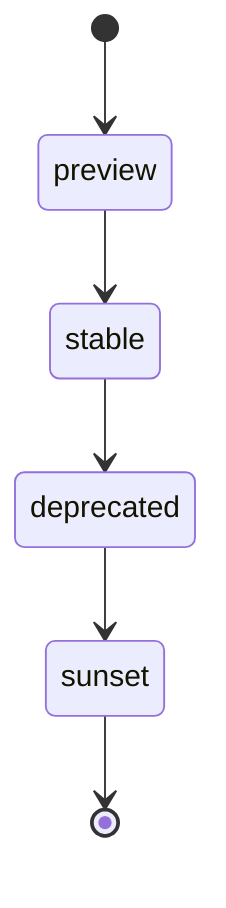

# Catálogo de APIs — Contratos del Nodo Cero

- **Área:** Arquitectura de Software / Gobernanza de APIs
- **Sistema:** RDM Digital Hub — Nodo Cero
- **Arquitectura:** Heptafederación YUN
- **Clasificación:** Artefacto normativo de gobernanza técnica
- **Fuente única de verdad:** `lib/governance/contracts.ts`
- **Total de contratos gobernados:** 10
- **Política de versiones:** SemVer estricto
- **Ciclo de vida:** `preview → stable → deprecated → sunset`
- **Políticas de despliegue:** `canary | stable | blue-green`
- **Estado:** Vigente

---

## Naturaleza normativa

Este catálogo define la constitución técnica de las interfaces públicas del **RDM Digital Hub — Nodo Cero**.

Cada contrato representa un compromiso verificable entre el Nodo Cero, sus consumidores, sus dominios operativos y la Heptafederación YUN. Cada versión representa un pacto explícito de compatibilidad; cada despliegue constituye una decisión trazable de soberanía operativa.

La fuente única de verdad es:

```text
lib/governance/contracts.ts
```

Ningún contrato público, federado o estable puede declararse vigente fuera de este registro. Una ruta puede existir técnicamente durante desarrollo interno, pero no adquiere condición de contrato gobernado hasta que cuente con identificador, versión SemVer, dueño YUN, ciclo de vida, política de compatibilidad y estrategia de despliegue.

---

## Alcance

Este documento gobierna:

- Contratos públicos del Nodo Cero.
- Contratos consumidos por aplicaciones, paneles, integraciones o nodos federados.
- Interfaces que requieren garantías explícitas de compatibilidad.
- Cambios de versión, migración, retiro y despliegue.
- Propiedad funcional bajo dominios de la Heptafederación YUN.
- Reglas mínimas de seguridad, trazabilidad, observabilidad y auditoría.
- Identificación de contratos que requieren atención o retiro.

Este documento no sustituye los contratos técnicos Zod, el documento OpenAPI, los ADRs, la política Zero Trust ni las reglas de autorización. Los coordina bajo una única capa de gobernanza de interfaz.

---

# Fuente de verdad

## Registro canónico

La definición ejecutable de contratos reside en:

```text
lib/governance/contracts.ts
```

El registro canónico debe declarar, como mínimo:

```ts
{
  id: "api.dominio.capacidad",
  route: "/api/dominio/recurso",
  methods: ["GET", "POST"],
  version: "1.0.0",
  owner: "dominio-yun",
  lifecycle: "preview",
  compatibility: "additive",
}
```

Todo contrato gobernado debe incluir:

| Campo | Obligatorio | Propósito |
|---|---:|---|
| `id` | Sí | Identificador único, estable y legible |
| `route` | Sí | Ruta o familia de rutas bajo gobernanza |
| `methods` | Sí | Métodos HTTP permitidos |
| `version` | Sí | Versión SemVer válida |
| `owner` | Sí | Dueño explícito dentro de YUN |
| `lifecycle` | Sí | Estado de adopción, soporte o retiro |
| `compatibility` | Sí | Regla de compatibilidad del contrato |
| Estrategia de despliegue | Derivada | Resultado de `deployPolicy(contract)` |
| Pruebas | Sí | Evidencia de compatibilidad y política |

---

# Contratos activos

## Registro oficial

| Contrato | Ruta | Métodos | Versión | Dueño YUN | Compatibilidad | Ciclo de vida |
|---|---|---|---:|---|---|---|
| `api.isabella.chat` | `/api/isabella` | `POST`, `GET` | `4.0.0` | `núcleo-cognitivo` | `breaking` | `stable` |
| `api.isabella.reason` | `/api/isabella/isa/reason` | `POST` | `4.0.0` | `núcleo-cognitivo` | `breaking` | `stable` |
| `api.isabella.gateway` | `/api/isabella/gateway` | `POST`, `GET` | `1.0.0` | `crown` | `additive` | `stable` |
| `api.isabella.crypto` | `/api/isabella/crypto/{sign,verify}` | `POST` | `2.0.0` | `trazabilidad` | `breaking` | `stable` |
| `api.monitor.state` | `/api/monitor/state` | `GET` | `1.0.0` | `observabilidad` | `additive` | `stable` |
| `api.monitor.health` | `/api/monitor/health` | `GET` | `1.0.0` | `observabilidad` | `additive` | `stable` |
| `api.monitor.events` | `/api/monitor/events` | `GET` | `1.0.0` | `observabilidad` | `additive` | `stable` |
| `api.twins` | `/api/twins/{models,instances,graph,simulate,query}` | `GET`, `POST` | `1.0.0` | `experiencia` | `additive` | `stable` |
| `api.city` | `/api/city/{ioc,incidents,mobility,response,scorecard}` | `GET`, `POST` | `1.0.0` | `operacion` | `additive` | `stable` |
| `api.gamification` | `/api/gamification/{events,session}` | `POST`, `GET` | `1.0.0` | `experiencia` | `additive` | `stable` |

## Responsabilidad funcional

| Contrato | Responsabilidad |
|---|---|
| `api.isabella.chat` | Interacción conversacional y asistencia territorial de Isabella |
| `api.isabella.reason` | Razonamiento del núcleo ISA soberano |
| `api.isabella.gateway` | Acceso controlado al CROWN Gateway y capacidades federadas opcionales |
| `api.isabella.crypto` | Firma MSR y verificación criptográfica de trazabilidad |
| `api.monitor.state` | Estado operacional consolidado del Nodo Cero |
| `api.monitor.health` | Salud de servicios, capacidades y dependencias |
| `api.monitor.events` | Consulta de eventos de monitoreo y diagnóstico |
| `api.twins` | Modelos, instancias, grafo, simulación y consulta de gemelos territoriales |
| `api.city` | IOC, incidentes, movilidad, respuesta operativa y scorecard |
| `api.gamification` | Sesiones y eventos de gamificación con backend autoritativo |

---

# Ciclo de vida

## Estados oficiales

```text
preview → stable → deprecated → sunset
```

| Estado | Definición | Condición de uso | Política de despliegue |
|---|---|---|---|
| `preview` | Contrato experimental con adopción limitada | Solo consumidores autorizados y pruebas de integración | `canary` |
| `stable` | Contrato soportado y apto para producción | Uso general dentro de sus permisos y scopes | `stable` |
| `deprecated` | Contrato vigente temporalmente con sustituto disponible | Exclusivamente compatibilidad y migración | `stable` |
| `sunset` | Contrato en proceso formal de retiro | Consumidores remanentes hasta la fecha límite | `blue-green` |

## Transición permitida



La transición de ciclo de vida debe ser explícita, versionada, registrada y comunicada a los consumidores afectados.

No se permite:

- Declarar `stable` un contrato sin pruebas de compatibilidad y seguridad.
- Retirar una interfaz usada sin pasar por `deprecated` y `sunset`, salvo respuesta a incidente crítico.
- Mantener indefinidamente un contrato `deprecated`.
- Promover un contrato de `preview` a `stable` sin dueño YUN responsable.
- Omitir una estrategia de migración al declarar un contrato `deprecated`.

## Atención obligatoria

Los contratos en los estados siguientes deben aparecer en:

```ts
contractsNeedingAttention()
```

```text
deprecated
sunset
```

Esta función permite identificar contratos con deuda de migración, consumidores pendientes, riesgo de retiro o necesidad de comunicación institucional.

---

# Compatibilidad

## Norma SemVer

| Cambio | Ejemplo | Clasificación | Consecuencia |
|---|---|---|---|
| Major | `4.0.0 → 5.0.0` | Breaking | Migración coordinada obligatoria |
| Minor | `4.0.0 → 4.1.0` | Additive | Permitido si no rompe consumidores |
| Patch | `4.0.0 → 4.0.1` | Correctivo | Permitido si preserva el contrato |
| Eliminación de campo | Quitar un atributo publicado | Breaking | Nueva major y migración |
| Cambio de tipo | `string → object` | Breaking | Nueva major y migración |
| Nuevo campo opcional | Añadir atributo ignorable | Additive | Minor o patch según impacto |
| Nuevo campo obligatorio | Modificar request requerido | Breaking | Nueva major y migración |
| Cambio de semántica | Mismo tipo, significado distinto | Breaking | Nueva major y migración |
| Cambio de ruta o método | Modificar URI o HTTP verb | Breaking | Ruta paralela o nueva major |

## Reglas inquebrantables

1. Un **bump major** siempre se considera breaking.
2. Todo cambio `v4 → v5`, `v1 → v2` o equivalente requiere migración coordinada.
3. Los cambios minor o patch solo se permiten cuando el contrato está declarado como `additive`.
4. Un contrato declarado `breaking` exige migración ante cualquier cambio de versión.
5. Ninguna ruta pública puede cambiar semántica, tipo, método o campos obligatorios sin evaluación de compatibilidad.
6. La compatibilidad no se presume: debe evaluarse mediante la función oficial.
7. Un cambio de autorización, scope o clasificación de datos debe documentarse como impacto operativo para consumidores.
8. Un cambio urgente de seguridad puede aplicarse de inmediato, pero debe registrarse posteriormente con su justificación, alcance y medidas de mitigación.

## Validación de compatibilidad

La decisión se realiza mediante:

```ts
checkCompatibility(contractId, from, to)
```

La función debe utilizarse antes de aprobar un cambio de versión, publicar documentación o promover un contrato a producción.

---

# Política de despliegue

## Matriz oficial

| Ciclo de vida | Política | Objetivo |
|---|---|---|
| `preview` | `canary` | Limitar exposición, medir comportamiento y permitir reversión rápida |
| `stable` | `stable` | Operación normal con soporte de producción |
| `deprecated` | `stable` | Mantener compatibilidad mientras se completa la migración |
| `sunset` | `blue-green` | Retiro controlado y reversión verificable |

## Resolución de política

La política se determina exclusivamente mediante:

```ts
deployPolicy(contract)
```

Resultado esperado:

```text
preview    → canary
stable     → stable
deprecated → stable
sunset     → blue-green
```

No se permite que un equipo seleccione una política arbitraria cuando contradiga el ciclo de vida declarado.

## Evidencia de despliegue

Cada despliegue de un contrato gobernado debe registrar:

```text
contractId
version
owner
lifecycle
compatibility
deploymentPolicy
timestamp
environment
commit o release asociado
resultado
traceId o identificador de auditoría
```

La evidencia de despliegue permite auditar qué versión se promovió, bajo qué política, con qué dueño y con qué resultado.

---

# Soberanía y propiedad YUN

## Dueño obligatorio

Todo contrato debe tener un dueño YUN explícito. El dueño responde por:

- Evolución funcional del contrato.
- Calidad de documentación.
- Compatibilidad y planes de migración.
- Seguridad y clasificación de datos.
- Definición de scopes y autorización.
- Cobertura de pruebas.
- Métricas, alertas y observabilidad.
- Comunicación de deprecaciones o retiros.
- Coordinación federada cuando corresponda.

No se permite crear un contrato con dueño implícito, compartido de manera ambigua o inexistente.

## Dominios actuales

| Dueño YUN | Responsabilidad principal |
|---|---|
| `núcleo-cognitivo` | Isabella, ISA, razonamiento y asistencia soberana |
| `crown` | Gateway de IA federada opcional |
| `trazabilidad` | Firmas MSR, evidencia, integridad y flujos criptográficos |
| `observabilidad` | Estado, salud, eventos, métricas y alertas |
| `experiencia` | Gemelos, turismo, interacción y gamificación |
| `operacion` | IOC, ciudad, activos, redes e infraestructura |
| `identidad` | API keys, scopes, rotación, revocación e introspección |
| `federacion` | CITEMESH, ruteo, topologías y salud P2P |
| `conocimiento` | GEMET, ontologías, réplicas y conocimiento federado |
| `continuidad` | Journal, reconciliación, failover y recuperación |
| `patrimonio` | Archivo histórico, curación, búsqueda y procedencia |
| `economia` | Marketplace, licencias, checkout y payouts |

---

# Seguridad de contratos

## Guardián único

Todas las rutas API deben utilizar el guardián compartido:

```text
app/api/_shared/route-guard
```

Este componente centraliza los controles de acceso y evita implementaciones de seguridad divergentes entre endpoints.

Controles mínimos aplicables:

```text
Verificación de origen
Autenticación
Validación de API key
Validación de scopes
Rate limiting
Comparación en tiempo constante
Validación Zod
Fail-closed
Trazabilidad
Auditoría
```

## Identidad soberana

Las API keys nativas se administran mediante:

```text
lib/security/identity/
app/api/identity/*
```

Reglas obligatorias:

- Las claves se emiten con el prefijo `rdm_live_`.
- Las claves se almacenan únicamente como hash `scrypt`.
- El valor plano se revela una sola vez: durante emisión o rotación.
- Las claves revocadas deben dejar de funcionar de forma inmediata.
- Los scopes se verifican antes de ejecutar operaciones protegidas.
- Los listados de claves nunca devuelven secretos ni hashes.
- Las operaciones administrativas deben generar evidencia de auditoría.

## Trazabilidad

Toda operación relevante debe preservar:

```text
traceId
correlationId
```

Los contratos relacionados con federación, continuidad, archivo, trazabilidad o criptografía pueden requerir evidencia adicional, incluyendo sobres semánticos del **YUN Quantum Semantic Core**.

---

# Obligaciones de calidad

## Antes de registrar

Antes de añadir un contrato a `lib/governance/contracts.ts`, el dueño YUN debe verificar:

1. La ruta utiliza `route-guard`.
2. La entrada se valida con Zod.
3. La salida está documentada y no filtra información sensible.
4. El contrato posee identificador, versión, dueño y lifecycle.
5. La compatibilidad está declarada como `additive` o `breaking`.
6. Los scopes requeridos están definidos.
7. La política de despliegue se puede resolver mediante `deployPolicy(contract)`.
8. Existen pruebas funcionales, de autorización y de compatibilidad.
9. Se propagan `traceId` y `correlationId` cuando aplica.
10. Se generan métricas y evidencia de auditoría.
11. Se documentó la clasificación de datos.
12. Se actualizó este catálogo y, cuando aplique, `docs/openapi-yun.yaml`.

## Antes de desplegar

Antes de desplegar una nueva versión:

1. Ejecutar `checkCompatibility(contractId, from, to)`.
2. Confirmar la política resultante de `deployPolicy(contract)`.
3. Verificar que el ciclo de vida esté actualizado.
4. Confirmar que el dueño YUN aprueba el cambio.
5. Revisar métricas, errores y latencia de la versión previa.
6. Probar autenticación, scopes y comportamiento fail-closed.
7. Documentar estrategia de reversión.
8. Registrar la evidencia de despliegue.
9. Ejecutar pruebas de gobernanza y calidad.
10. Comunicar cambios incompatibles o deprecaciones a los consumidores.

---

# Prohibiciones

Queda prohibido:

- Crear un contrato público sin SemVer.
- Publicar una ruta estable sin ciclo de vida definido.
- Omitir dueño YUN.
- Desplegar un cambio breaking como minor o patch.
- Eliminar campos, modificar tipos o alterar semántica sin migración.
- Mantener contratos retirados sin estado `deprecated` o `sunset`.
- Aplicar políticas de despliegue que contradigan `deployPolicy(contract)`.
- Exponer secretos, tokens, hashes de credenciales, claves privadas o material criptográfico.
- Omitir validación de inputs externos.
- Saltar el `route-guard` en endpoints protegidos.
- Declarar una ruta interna como contrato federado sin evaluación de seguridad y gobernanza.
- Usar el plano de investigación como fuente autoritativa de decisiones operativas.

El incumplimiento de estas reglas debe considerarse deuda arquitectónica, riesgo de seguridad o incumplimiento de gobernanza, según el impacto del contrato afectado.

---

# Aplicación automatizada

## Funciones críticas

```ts
checkCompatibility(contractId, from, to)
deployPolicy(contract)
contractsNeedingAttention()
```

## Cobertura de pruebas

Las reglas de gobernanza se prueban en:

```text
tests/governance.test.ts
```

Cobertura mínima esperada:

- Validación de versiones SemVer.
- Detección de cambios major.
- Rechazo de cambios breaking sin migración.
- Aceptación de cambios additive compatibles.
- Resolución de política de despliegue.
- Identificación de contratos `deprecated` y `sunset`.
- Validación de identificadores, rutas y dueños.
- Consistencia entre lifecycle y política de despliegue.

## Comandos de verificación

```bash
npm run check:contracts
npm test -- governance
npm run lint
npx tsc --noEmit
npm run quality
```

---

# Declaración institucional

Este catálogo no es un inventario pasivo de endpoints.

Es la **constitución técnica del Nodo Cero**: cada contrato es un compromiso auditable; cada versión, un pacto explícito de estabilidad; cada despliegue, una evidencia de soberanía operativa; y cada retiro, una responsabilidad de migración con los usuarios, sistemas y nodos que dependen de la plataforma.

La gobernanza de APIs protege la continuidad del RDM Digital Hub, la evolución ordenada de la Heptafederación YUN y la confianza de quienes interactúan con el territorio digital de Real del Monte.

---

# Referencias

| Documento o código | Propósito |
|---|---|
| `lib/governance/contracts.ts` | Registro canónico de contratos |
| `tests/governance.test.ts` | Pruebas de compatibilidad y despliegue |
| `docs/openapi-yun.yaml` | Especificación OpenAPI del fabric YUN |
| `docs/c4-contexto.md` | Contexto, contenedores y componentes |
| `docs/mapa-dominios.md` | Mapa de dominios, propietarios y código |
| `docs/guia-modularizacion.md` | Modularización, contratos y `route-guard` |
| `docs/guia-desarrollador.md` | Convenciones de desarrollo |
| `docs/adr-0002-zero-trust-7-capas.md` | Seguridad Zero Trust |
| `docs/adr-0004-yun-be-continuidad.md` | Continuidad operacional |
| `docs/adr-0005-yun-quantum-semantic-core.md` | Integridad semántica y criptografía híbrida |
